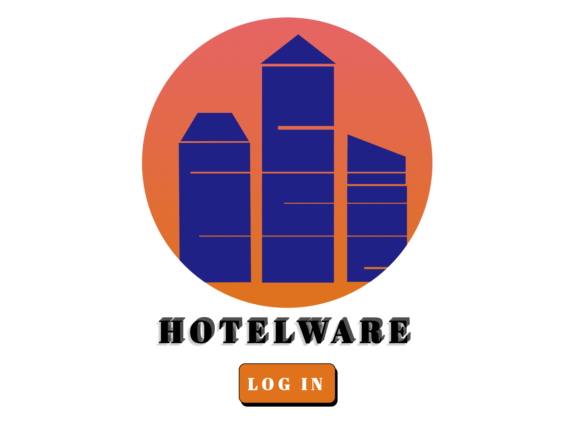
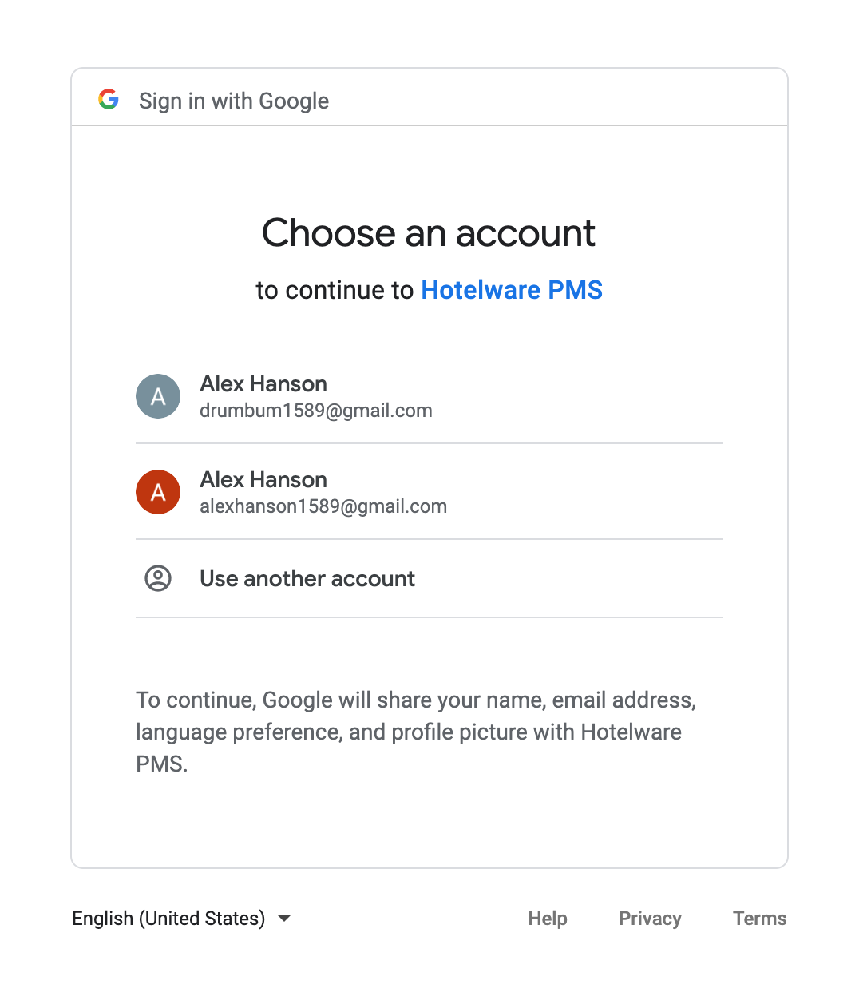
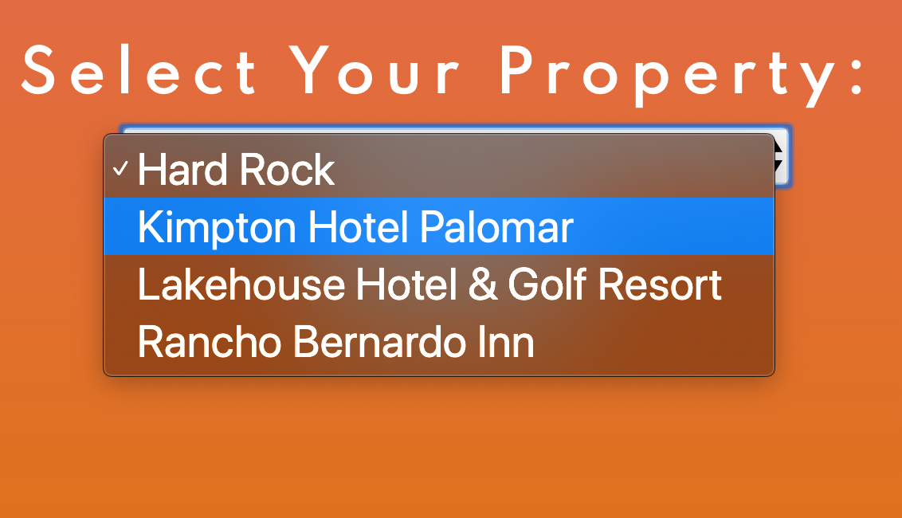
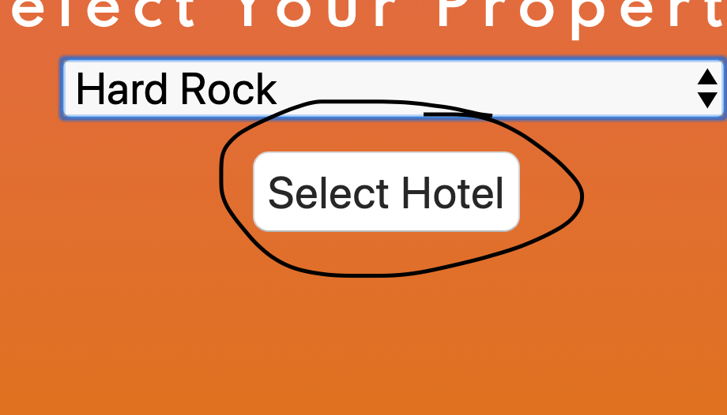
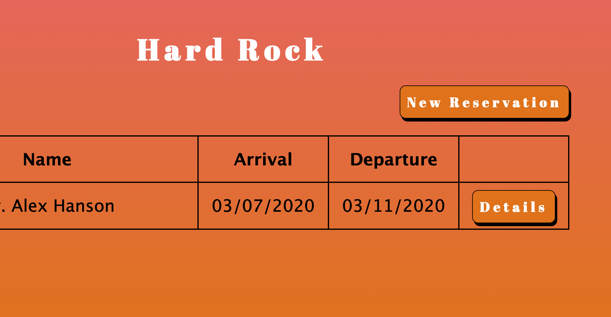

# Hotelware PMS #

#### Developed In #####

+ HTML
+ CSS
+ Javascript
    + Using Node.js with Express framework & MongoDb
    + Deployed on Heroku

#### Hotelware ####

 Is a hotel property management system. 

 Login in with your google account and start making reservations.

 

### Select a property from the drop menu and press the "select hotel" button to navigate to that hotel's main page. ###

### Press that button! ###

### Your property dashboard is very you can make new reservations or, update or delete existing reservations. ###

 #### Features ####

 Currently the app only works for hotel properties seeded into the database. A user can make, view, update, and delete reservations from any of the available properties.

 ## Future Features ##

+ Guest profile management.
    + create guest profiles independently of reseravations.
    + update & delete guest profiles.

+ Hotel profile management.
    + ability to update hotel info: descriptions, address, phone number, room types, etc...
    + track room inventory.
        + availability 
        + date conflicts
    
+ Guest lookup when making a reservation.
    + ability to populate new reservations with existing guest profiles.

[Visit Hotelware PMS](http://hotelware-pms.herokuapp.com/)